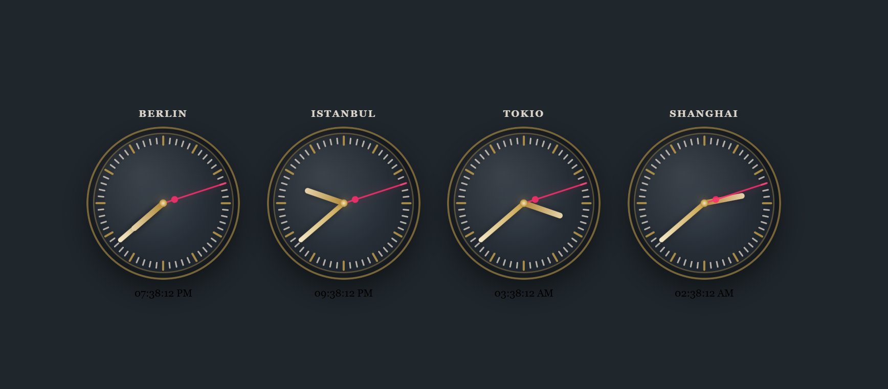

---

## 🧰 Tech Stack

### Languages

### Web

### Tools

---

## 🚀 Projects

### ⏰ HTML Clock

---

### ☕ Java REST API

---

### 🏗 Architecture

---

## 👋 About Me

- 💻 App & Game Development  
- 📱 Flutter / Android  
- ⚙️ Java & REST APIs  
- 🎮 Unity Experiments  

---
