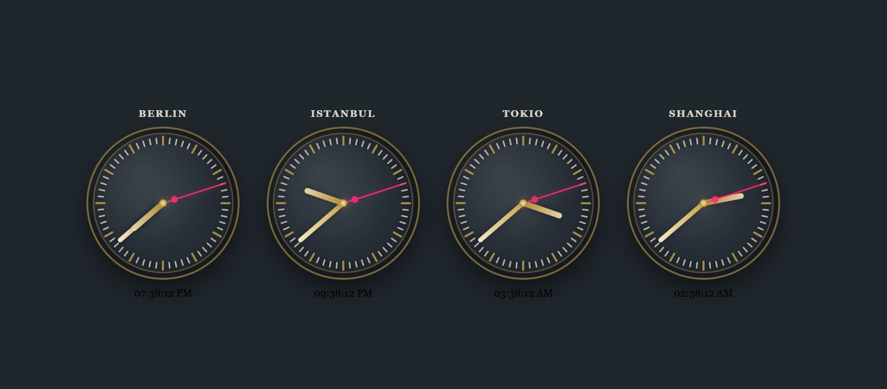

## About Me

I am an aspiring Software Developer currently retraining (FIAE) with a strong interest in web and mobile application development. 
My focus is on building clean, user-friendly interfaces and turning ideas into functional digital products. 
I enjoy learning new technologies, solving problems, and continuously improving my technical and creative skills through real projects.

My main interests include full-stack development, UI/UX design, and application architecture. 
I value structured thinking, teamwork, and long-term growth in the tech industry.

For more information visit [my portfolio](https://cituspr.github.io/Project_Portfolio_Website/).

## Tech Stack

## HTML Clock

## Java REST API Preview

## Architecture

## Featured Project – DB Backup Tool

A Python CLI & Flask Web UI tool for database backup simulation.

